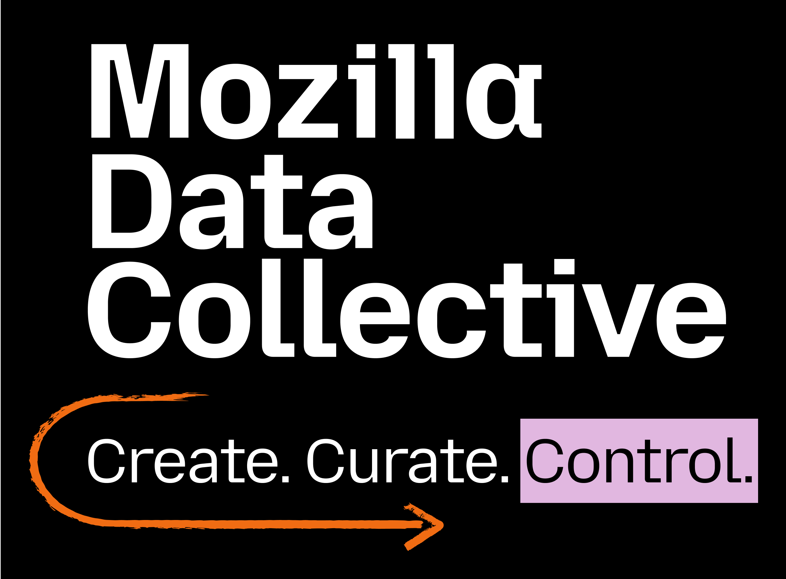

<p align="center">
  <picture>
    <!-- When the user prefers dark mode, show the white logo -->
    <source media="(prefers-color-scheme: dark)" srcset="./docs/mdc_logo_white.png">
    <!-- When the user prefers light mode, show the black logo -->
    <source media="(prefers-color-scheme: light)" srcset="./docs/mdc_logo.png">
    <!-- Fallback: default to the black logo -->
    
  </picture>
</p>

<div align="center">

[](https://github.com/Mozilla-Data-Collective/datacollective-python/actions/workflows/publish.yml/)
[](https://github.com/Mozilla-Data-Collective/datacollective-python/actions/workflows/docs.yml/)
[](https://github.com/Mozilla-Data-Collective/datacollective-python/actions/workflows/tests.yml/)

</div>

# Mozilla Data Collective Python Client Library

The official Python SDK for accessing and contributing to the [Mozilla Data Collective](https://datacollective.mozillafoundation.org/) platform.

## Installation

```bash
pip install datacollective
```

## Quick Start

**IMPORTANT NOTE:** Before trying to access any dataset, make sure you have thoroughly **read and agreed** to the specific dataset's conditions & licensing terms.

1. **Get your API key** from the Mozilla Data Collective [dashboard](https://datacollective.mozillafoundation.org/api-reference)

2. **Set the API key in your environment variable**:

**Option A:** Run this command in your terminal (replace `your-api-key-here` with your actual API key):

```
export MDC_API_KEY=your-api-key-here
```

**Option B:** Create a `.env` file in your project directory and add this line:

```
MDC_API_KEY=your-api-key-here
```

3. **Get your dataset ID from the last section of the dataset URL at the MDC website**. 

> [!TIP]
> You can find the `dataset-id` by looking at the URL of the dataset's page on MDC platform. The ID is the unique string of characters located at the very end of the URL, after the `/datasets/` path. For example, for URL `https://datacollective.mozillafoundation.org/datasets/cminc35no007no707hql26lzk` dataset id will be `cminc35no007no707hql26lzk`.

4. **Save a dataset locally**:
```
from datacollective import download_dataset

dataset_path = download_dataset("your-dataset-id")
```

> [!NOTE]
> `download_dataset` was previously called `save_dataset_to_disk`. The old name still works for backward compatibility, but it is deprecated and new code should use `download_dataset`.

> [!TIP]
> **Automatic Resume:** If a download is interrupted (e.g., due to a network error or it gets stopped it manually), the next time you try download the same dataset at the same folder location, we will automatically resume from where the download left off!


5. **Get information & metadata about a dataset**:

```
from datacollective import get_dataset_details

details = get_dataset_details("your-dataset-id")
```

6. **Load the dataset into a pandas DataFrame _(**Alpha version:** Only certain MDC datasets are supported right now)_**:

```
from datacollective import load_dataset

dataset = load_dataset("your-dataset-id")
```

## Programmatic submissions and uploads

You can create dataset submissions and upload files with resumable uploads into the MDC platform programmatically using our Python SDK:

```python
from datacollective import DatasetSubmission, License, Task, create_submission_with_upload

submission = DatasetSubmission(
    name="Dataset Name",
    longDescription="A detailed description of the dataset.",
    shortDescription="A brief description of the dataset.",
    locale="en-US",
    task=Task.ASR,
    format="TSV",
    licenseAbbreviation=License.CC_BY_4_0,
    other="This text should provide a detailed description of the dataset, "
          "including its contents, structure, and any relevant information "
          "that would help users understand what the dataset is about "
          "and how it can be used.",
    restrictions="Any restrictions you want to impose on the dataset",
    forbiddenUsage="Use cases that are not allowed with this dataset",
    additionalConditions="Any additional conditions for using the dataset",
    pointOfContactFullName="Jane Doe",
    pointOfContactEmail="jane@example.com",
    fundedByFullName="Funder Name",
    fundedByEmail="funder@example.com",
    legalContactFullName="Legal Name",
    legalContactEmail="legal@example.com",
    createdByFullName="Creator Name",
    createdByEmail="creator@example.com",
    intendedUsage="Describe the intended usage of the dataset, including "
                  "potential applications and use cases.",
    ethicalReviewProcess="Describe the ethical review process that was "
                         "followed for this dataset, including any approvals "
                         "or considerations related to data collection and usage.",
    exclusivityOptOut=False,  # True = This dataset is non-exclusive to Mozilla Data Collective, 
                              # False = Dataset is exclusively hosted in Mozilla Data Collective
    agreeToSubmit=True,  # True = You confirm that you have the right to submit this dataset and 
                         # that all information provided in the datasheet is accurate. 
                         # Required to be True to complete the submission process
)

response = create_submission_with_upload(
    file_path="/path/to/dataset.tar.gz",
    submission=submission
)

print(response)
```

For predefined licenses, pass `licenseAbbreviation=License.<VALUE>` and leave `licenseUrl` and `license` unset. For custom licenses, pass a custom string to `license` and optionally include `licenseUrl` and `licenseAbbreviation`.

> [!TIP]
> To upload a new `.tar.gz` version to an already approved dataset, call `upload_dataset_file(file_path=..., submission_id=...)` directly. Find the submission under **Profile → Uploads**, open the approved dataset, and copy the value after `/profile/submissions/` in the URL. Note that this value is the submission ID, which is different from the public dataset ID.

## For more details, visit [our docs](https://Mozilla-Data-Collective.github.io/datacollective-python/)

## License

This project is released under [MPL (Mozilla Public License) 2.0](./LICENSE).
